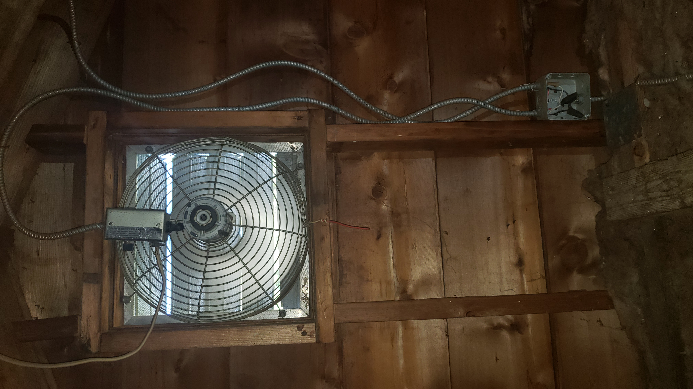

# Wiring Diagram: PoE Texas AC to USB-C Adapter for Shelly H&T Sensor



## Components
- PoE Texas In-Wall AC to USB-C Power Adapter
- Junction box with AC wiring (Hot, Neutral, Ground)
- AINOPE USB-C to USB-C Cable (10ft, right angle)
- Shelly H&T Sensor (USB-C power input)

## Diagram

```
Junction Box Wiring:                  PoE Texas Adapter:         USB-C Cable:         Shelly H&T Sensor:

+------------------+                  +-------------------+      +-------------+      +------------------+
|                  |                  | Black  (Hot)   <-------> |             |      |                  |
|   Black  (Hot)   |------------------|                         |             |------|                  |
|                  |                  |                         |             |      |                  |
|   Black  (Hot)   |------------------|                         |             |      |                  |
|                  |                  | White  (Neutral) <----->|             |      |                  |
|   White (Neutral)|------------------|                         |             |      |                  |
|                  |                  |                         |             |      |                  |
|   White (Neutral)|------------------|                         |             |      |                  |
|                  |                  | Ground (if present)<--->|             |      |                  |
|   Ground         |------------------|                         |             |      |                  |
+------------------+                  +-------------------+      +-------------+      +------------------+

Step 1: 
  - Turn off power at the breaker.
  - Open attic junction box.

Step 2:
  - Connect BOTH black wires (hot) from the junction box to the adapter's black lead.
  - Connect BOTH white wires (neutral) from the junction box to the adapter's white lead.
  - Connect ground wire (if present) to adapter's ground lead.

Step 3:
  - Mount the adapter flush in the box or nearby wall.
  - Plug the USB-C cable from the adapter into the Shelly H&T sensor.

Step 4:
  - Restore power, verify 5V output.
  - Confirm Shelly H&T powers up.

Step 5:
  - Set up Shelly H&T WiFi and automation.

## Notes

- Use wire nuts for all connections, and ensure no bare copper is exposed.
- Secure all devices and cable routing to prevent damage.
- If unsure or if box is crowded, consider installing a new single-gang box for the adapter.
- Always comply with local electrical codes—consider hiring an electrician if needed.
