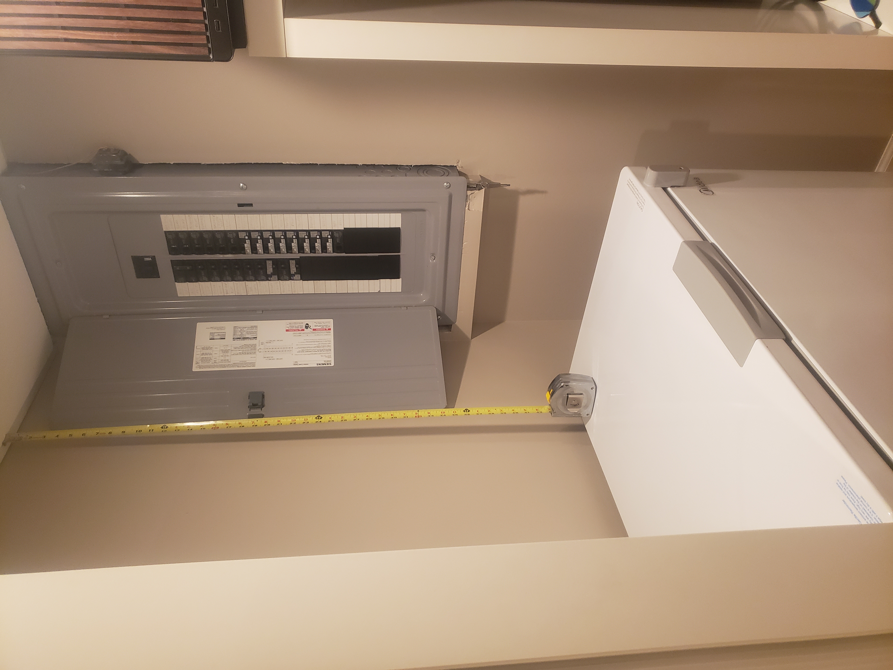

# Electrical System Information

This document summarizes the current electrical system, recent upgrades, usage, and high-level backup power strategy for the property.

---

## 1. Service Entrance & Main Panel

- **Main Service Amperage:** 200A (confirmed)
- **Service Voltage:** 120/240V (assumed typical for residential)
- **Utility Provider:** PSE&G
- **Main Panel Location:** Basement, south side
- **Panel Manufacturer/Model:** Siemens
- **Year Installed/Upgraded:** 2022 (with 1st floor remodel & new kitchen)
- **Breaker Capacity:** (Not specified)
- **Subpanels:** None – only one panel
- **Grounding/Bonding:** (Not specified)

**Breaker Panel Photo:**  

---

## 2. Electrical Usage

- **Average January Usage:** 34 kWh/day
- **Average July Usage:** 41 kWh/day

---

## 3. High-Level System Design

- **Solar:** Panels installed on new metal roof (planned)
- **Battery:** Battery storage system (planned, specs TBD)
- **Inverters & Transfer Switch:** To be specified
- **Backup Generator:** Natural gas generator under the deck (with 240V plug)
    - Used in extended outage scenarios
    - Generator starts after battery is depleted or to conserve gas during sunny days
- **Strategy:**  
    - In storm/outage, battery provides initial backup  
    - Generator runs when battery is low or solar unavailable  
    - During daytime, solar and battery reduce generator runtime and fuel use

---

## 4. Major Loads

- **Must Loads (Backup Priority):**
    - Refrigerator
    - Home Networking
    - HVAC (Gas Furnace and Trane Air Conditioner)
- **Kitchen Loads:** New as of 2022 remodel

---

## 5. Other Notes

- **Smart Meter:** (Not specified)
- **Surge Protection:** (Not specified)
- **Known Issues:** (None reported)
- **Other:** Main breaker is labeled 200A. No pool, hot tub, or EV charger at this time.

---

*Document last updated: 2025-08-11*