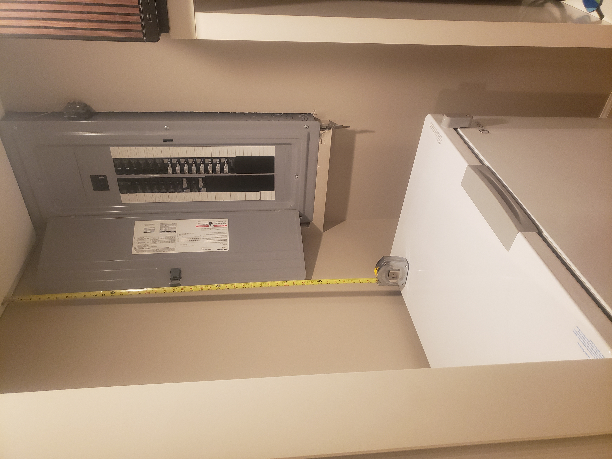

# Electrical System Information

This document summarizes the current electrical system, recent upgrades, usage, and high-level backup power strategy for the property.

---

## 1. Service Entrance & Main Panel

- **Main Service Amperage:** 200A (confirmed)
- **Service Voltage:** 120/240V (assumed typical for residential)
- **Utility Provider:** PSE&G
- **Main Panel Location:** Basement, south side
- **Panel Manufacturer/Model:** Siemens
- **Year Installed/Upgraded:** 2022 (with 1st floor remodel & new kitchen)
- **Breaker Capacity:** (Not specified)
- **Subpanels:** None – only one panel
- **Grounding/Bonding:** (Not specified)

**Breaker Panel Photo:**  

---

## 2. Electrical Usage

- **Average January Usage:** 34 kWh/day
- **Average July Usage:** 41 kWh/day

---

## 3. High-Level System Design

- **Solar:** Panels installed on new metal roof (planned)
- **Battery:** Battery storage system (planned, specs TBD)
- **Inverters & Transfer Switch:** To be specified
- **Backup Generator:** Natural gas generator under the deck (with 240V plug)
    - Used in extended outage scenarios
    - Generator starts after battery is depleted or to conserve gas during sunny days
- **Strategy:**  
    - In storm/outage, battery provides initial backup  
    - Generator runs when battery is low or solar unavailable  
    - During daytime, solar and battery reduce generator runtime and fuel use

---

## 4. Major Loads

- **Must Loads (Backup Priority):**
    - Refrigerator
    - Home Networking
    - HVAC (Gas Furnace and Trane Air Conditioner)
- **Kitchen Loads:** New as of 2022 remodel

---

## 5. Other Notes

- **Smart Meter:** (Not specified)
- **Surge Protection:** (Not specified)
- **Known Issues:** (None reported)
- **Other:** Main breaker is labeled 200A. No pool, hot tub, or EV charger at this time.

---

## 6. 2026 Home Energy Financial Specification Update (NJ)

### Scope

- **Solar Array:** 9.03 kW residential PV system
- **Battery Storage:** 2 residential batteries (Tesla Powerwall-class)
- **Utility/Policy Context:** PSE&G service territory with NJ net metering and NJ production incentives

### 2026 Market-Rate Assumptions

- **Installed Solar Price (NJ, 2026 residential range):** $2.70–$3.20/W
- **Modeled Solar Midpoint:** $2.85/W → **$25,736**
- **Installed Battery Price (Powerwall-class):** $12,500–$15,000 each
- **Modeled Battery Pair Cost:** **$27,000**
- **Modeled Gross Investment (Solar + 2 Batteries):** **$52,736**

### Incentives and Policy Effects

- **Federal ITC:** 30% assumed on eligible solar + battery scope  
  - **Modeled ITC Value:** **$15,821**
  - **Modeled Net Upfront Investment:** **$36,915**
- **Net Metering Effect (NJ):** Exported daytime solar offsets consumption at retail value through the annual cycle; annual net excess is generally compensated at a lower avoided-cost rate.
- **NJ Production Incentive (SuSI/TREC-style modeled input):** **$85/MWh**

### Annual Benefit Model

- **Modeled Annual PV Generation:** ~10,850 kWh/year
- **Modeled Energy Rate for Bill Offset:** $0.24/kWh blended
- **Annual Solar Bill Offset:** **$2,604/year**
- **Annual NJ Production Incentive:** **$922/year**
- **Incremental Battery Economic Value:** **$300–$600/year** under current net metering (primary battery benefit remains backup power/resilience)
- **Total Annual Benefit (Solar + 2 Batteries):** **$3,826–$4,126/year**

### Updated Financial Result

- **Total Project Investment (gross):** **$52,736**
- **Net Investment after ITC:** **$36,915**
- **Updated Break-Even Timeline:** **~8.9–9.7 years**
- **Planning Note:** Keep system sizing near annual household usage to maximize retail-value credits and avoid low-value annual true-up exports.

---

*Document last updated: 2026-05-17*
