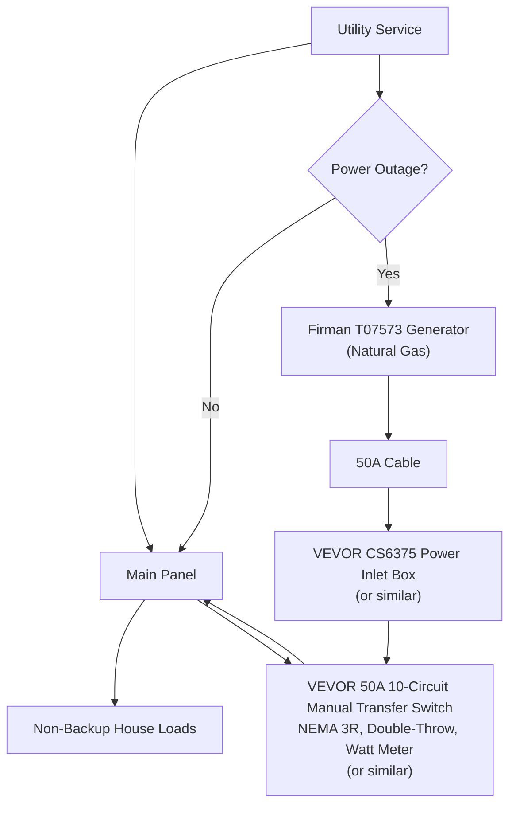

# Residential Backup Power Design — 11 S Ashby Ave

## Sequence

1. Utility service normally powers the main panel and house loads.
2. If primary utility power stops, deploy the Firman T07573 natural-gas generator.
3. Connect a 50A cable from the generator to the rear power inlet box (CS6375 style).
4. The inlet feeds the 50A, 10-circuit manual transfer switch kit (VEVOR or similar) located beside the main panel.
5. Add/confirm the required feeder/control wiring from the transfer switch back to the main panel so each selected branch circuit can be switched between utility and generator.
6. During outage mode, the transfer switch supplies only the selected backup circuits.

## Full Circuit Inventory with IDs

### Left Side (Top to Bottom)

| ID | Circuit | Breaker | Backup |
|---|---|---|---|
| L01 | A/C UNIT | 30A (2-pole, part 1) | No |
| L02 | A/C UNIT (continuation) | 30A (2-pole, part 2) | No |
| L03 | LAUNDRY LIGHT | 15A | No |
| L04 | WASHER / DRYER | 20A | No |
| L05 | BASEMENT RSPT | 20A | **Yes** |
| L06 | BASEMENT LIGHTS | 15A | **Yes** |
| L07 | MASTER BDR LIGHTS | 15A | No |
| L08 | VERIZON RSPT | 15A | **Yes** |
| L09 | KITCHEN LIGHTS | 15A Combination AFCI | **Yes** |
| L10 | BASEMENT RSPT | 20A | No |
| L11 | BATHROOM LIGHTS | 15A Combination AFCI | No |
| L12 | Blank / Unlabeled | — | Spare |
| L13 | Blank / Unlabeled | — | Spare |
| L14 | Blank / Unlabeled | — | Spare |
| L15 | Blank / Unlabeled | — | Spare |

### Right Side (Top to Bottom)

| ID | Circuit | Breaker | Backup |
|---|---|---|---|
| R01 | BATH - HALL LIGHTS | 15A | **Yes** |
| R02 | SUMP PUMP | 20A | **Yes** |
| R03 | BEDROOM RSPT | 20A | No |
| R04 | FURNACE | 15A | **Yes** |
| R05 | BASEMENT LIGHTS / RSPT / FRIDGE | 15A | **Yes** |
| R06 | KITCHEN COUNTER | 20A Combination AFCI | No |
| R07 | GARBAGE DISPOSAL | 20A Combination AFCI | No |
| R08 | MICROWAVE | 20A Combination AFCI | No |
| R09 | KITCHEN COUNTER | 20A Combination AFCI | No |
| R10 | PANTRY RSPT | 20A Combination AFCI | No |
| R11 | ISLAND | 20A Combination AFCI | **Yes** |
| R12 | DISHWASH | 20A Combination AFCI | No |
| R13 | STOVE (gas ignition load) | 20A Combination AFCI | **Yes** |
| R14 | BATH GFCI | 20A | No |

## Exact 10-Circuit Backup Assignment (Transfer Switch)

| Transfer Switch Position | Circuit ID | Circuit Name | Breaker |
|---|---|---|---|
| TS-01 | L05 | BASEMENT RSPT | 20A |
| TS-02 | L06 | BASEMENT LIGHTS | 15A |
| TS-03 | L08 | VERIZON RSPT | 15A |
| TS-04 | L09 | KITCHEN LIGHTS | 15A Combination AFCI |
| TS-05 | R01 | BATH - HALL LIGHTS | 15A |
| TS-06 | R02 | SUMP PUMP | 20A |
| TS-07 | R04 | FURNACE | 15A |
| TS-08 | R05 | BASEMENT LIGHTS / RSPT / FRIDGE | 15A |
| TS-09 | R11 | ISLAND | 20A Combination AFCI |
| TS-10 | R13 | STOVE (gas ignition load) | 20A Combination AFCI |

## Validation Checklist

- Confirm each candidate breaker number and amperage in the Siemens main panel.
- Verify transfer switch circuit amp limits and pole requirements (120V single-pole vs any 240V/tied loads).
- Validate Firman T07573 available running watts against simultaneous selected loads.
- Mark final selected circuits in the transfer switch schedule and panel directory.
- Have a licensed electrician confirm code-compliant wiring and interconnection details before installation.
