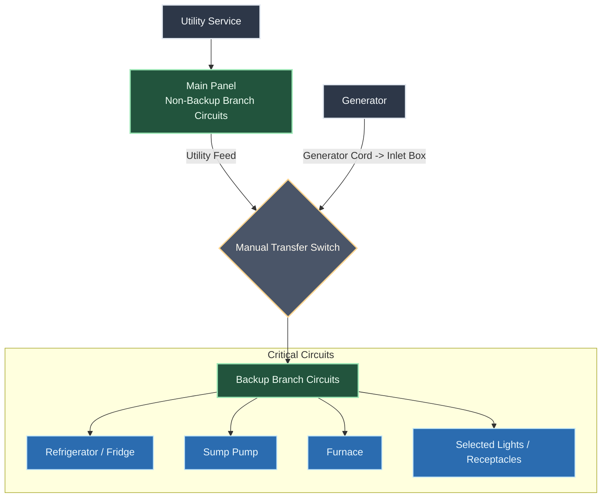

# Residential Backup Power Design — 11 S Ashby Ave

**Purpose:** Field reference for a licensed electrician to review, verify, and implement a manual generator backup arrangement for selected branch circuits.

## 1. Component Diagram

## 2. Component Table

| Logical Component | Implementation | Notes |
|---|---|---|
| Utility Service | PSE&G 120/240V, single-phase residential service | Normal source |
| Main Panel | Siemens 200A main panel | Located in basement |
| Generator | Firman T07573 natural-gas generator | Backup source |
| Generator Cord | NEMA 14-50P Male to SS2-50R STW 6/3+8/1 AWG 125/250V Twist Locking | Minimum 20 ft exterior run to house |
| Power Inlet Box | Rear-mounted CS6375-style inlet box | Generator connection point |
| Manual Transfer Switch | 50A, 10-circuit manual transfer switch | Mounted adjacent to main panel |
| Backup Branch Circuits | Selected house circuits | Switched between utility and generator |
| Non-Backup Branch Circuits | Remaining house circuits | Remain on normal service |

## 3. System Arrangement

- **Utility source:** PSE&G 120/240V, single-phase residential service.
- **Main service equipment:** Siemens 200A main panel located in the basement.
- **Backup source:** Firman T07573 natural-gas generator.
- **Generator connection:** 50A cord to a rear-mounted power inlet box.
- **Transfer equipment:** 50A, 10-circuit manual transfer switch mounted adjacent to the main panel.
- **Backup load method:** Selected branch circuits are transferred between utility and generator through the manual transfer switch.
- **Generator-to-house cable run:** The 50A cable from the generator to the house should be at least 15 ft.
- **Indoor inlet-to-panel run:** The indoor line from the inlet across the basement to the panel will be 25 ft.

## 4. Schematic Notes for Electrician Review

1. Verify the inlet, cord, transfer switch, and breaker ratings are compatible with the generator output and the selected branch circuits.
2. Confirm the transfer switch is suitable for the required circuit types, including any shared neutral, AFCI, or multi-pole considerations.
3. Confirm whether any loads marked for backup require 120V single-pole transfer only and whether any 2-pole loads are excluded.
4. Label the main panel directory and transfer switch positions to match the final as-built circuit assignment.
5. Confirm grounding, bonding, mounting method, working clearances, and local code requirements before installation.
6. Confirm the final cable routing and lengths satisfy the generator connection plan: minimum 20 ft exterior cord run and 25 ft interior inlet-to-panel run.

## 5. Panel Schedule Reference

### Left Side (Top to Bottom)

| ID | Circuit | Breaker | Backup |
|---|---|---|---|
| L01 | A/C UNIT | 30A (2-pole, part 1) | No |
| L02 | A/C UNIT (continuation) | 30A (2-pole, part 2) | No |
| L03 | LAUNDRY LIGHT | 15A | No |
| L04 | WASHER / DRYER | 20A | No |
| L05 | BASEMENT RSPT | 20A | **Yes** |
| L06 | BASEMENT LIGHTS | 15A | **Yes** |
| L07 | MASTER BDR LIGHTS | 15A | No |
| L08 | VERIZON RSPT | 15A | No |
| L09 | KITCHEN LIGHTS | 15A Combination AFCI | **Yes** |
| L10 | BASEMENT RSPT | 20A | **Yes** |
| L11 | BATHROOM LIGHTS | 15A Combination AFCI | No |
| L12 | Blank / Unlabeled | — | Spare |
| L13 | Blank / Unlabeled | — | Spare |
| L14 | Blank / Unlabeled | — | Spare |
| L15 | Blank / Unlabeled | — | Spare |

### Right Side (Top to Bottom)

| ID | Circuit | Breaker | Backup |
|---|---|---|---|
| R01 | BATH - HALL LIGHTS | 15A | **Yes** |
| R02 | SUMP PUMP | 20A | **Yes** |
| R03 | BEDROOM RSPT | 20A | No |
| R04 | FURNACE | 15A | **Yes** |
| R05 | BASEMENT LIGHTS / RSPT / FRIDGE | 15A | **Yes** |
| R06 | KITCHEN COUNTER | 20A Combination AFCI | No |
| R07 | GARBAGE DISPOSAL | 20A Combination AFCI | No |
| R08 | MICROWAVE | 20A Combination AFCI | No |
| R09 | KITCHEN COUNTER | 20A Combination AFCI | No |
| R10 | PANTRY RSPT | 20A Combination AFCI | No |
| R11 | ISLAND | 20A Combination AFCI | **Yes** |
| R12 | DISHWASH | 20A Combination AFCI | No |
| R13 | STOVE (gas ignition load) | 20A Combination AFCI | **Yes** |
| R14 | BATH GFCI | 20A | No |

## 6. Final 10-Circuit Backup Assignment

| Transfer Switch Pos. | Circuit ID | Circuit Name | Breaker |
|---|---|---|---|
| TS-01 | L05 | BASEMENT RSPT | 20A |
| TS-02 | L06 | BASEMENT LIGHTS | 15A |
| TS-03 | L09 | KITCHEN LIGHTS | 15A Combination AFCI |
| TS-04 | L10 | BASEMENT RSPT | 20A |
| TS-05 | R01 | BATH - HALL LIGHTS | 15A |
| TS-06 | R02 | SUMP PUMP | 20A |
| TS-07 | R04 | FURNACE | 15A |
| TS-08 | R05 | BASEMENT LIGHTS / RSPT / FRIDGE | 15A |
| TS-09 | R11 | ISLAND | 20A Combination AFCI |
| TS-10 | R13 | STOVE (gas ignition load) | 20A Combination AFCI |

## 7. Field Verification Checklist

- Confirm the exact breaker numbers, amperages, and tie requirements in the Siemens main panel.
- Confirm the transfer switch supports the selected circuits and any required pole configuration.
- Confirm the generator output rating is sufficient for the planned simultaneous loads.
- Verify which circuits are actually included in the final backup set before any wiring changes are made.
- Have a licensed electrician confirm code-compliant installation, interconnection, labeling, and clearances before energizing.
- Confirm the exterior and interior cable run lengths and routing before purchase and installation.

## 8. Electrician Services to Be Performed

| Service | Status / Notes |
|---|---|
| Inlet Install | Needed; install the generator inlet box at the exterior connection point |
| Indoor Circuit Run | Needed; run the indoor circuit from the inlet across the basement to the main panel |
| Transfer Switch Install and Wiring | Needed; install the 50A, 10-circuit manual transfer switch and complete all associated wiring |

## 9. Remaining Equipment Needed

| Item | Status / Notes |
|---|---|
| Generator Cable | Still needed; use the specified NEMA 14-50P Male to SS2-50R STW 6/3+8/1 AWG 125/250V Twist Locking cord |
| Inlet Box | Still needed; rear-mounted inlet box for the generator connection |
| Transfer Switch | Still needed; 50A, 10-circuit manual transfer switch |
| Indoor Cable | Still needed; cable for the 25 ft inlet-to-panel run across the basement |
| Indoor Conduit | Still needed; conduit for the 25 ft indoor run |

## 10. Installer Notes

- This document is a planning reference, not a stamped electrical drawing.
- Final wiring should be field-verified against the actual panel directory and equipment nameplates.
- Any circuit with ambiguous labeling should be traced and renamed before final handoff.
